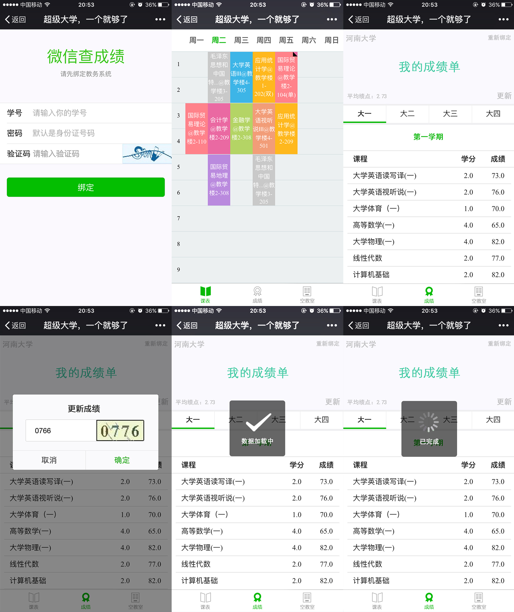
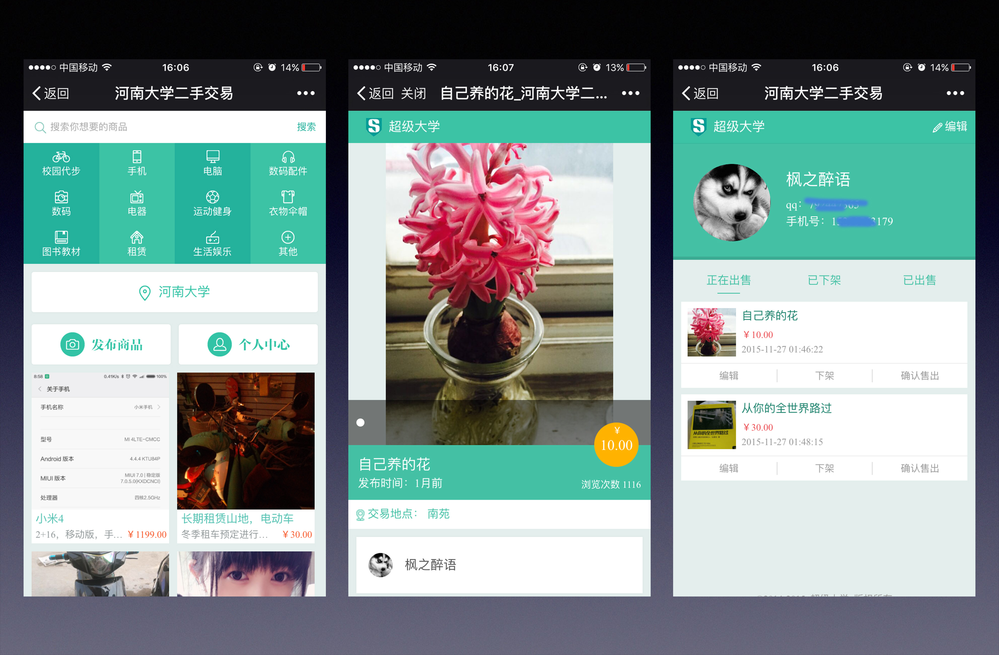
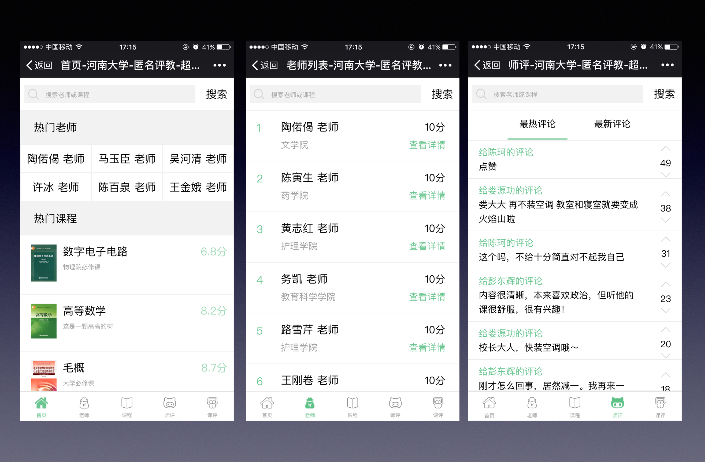
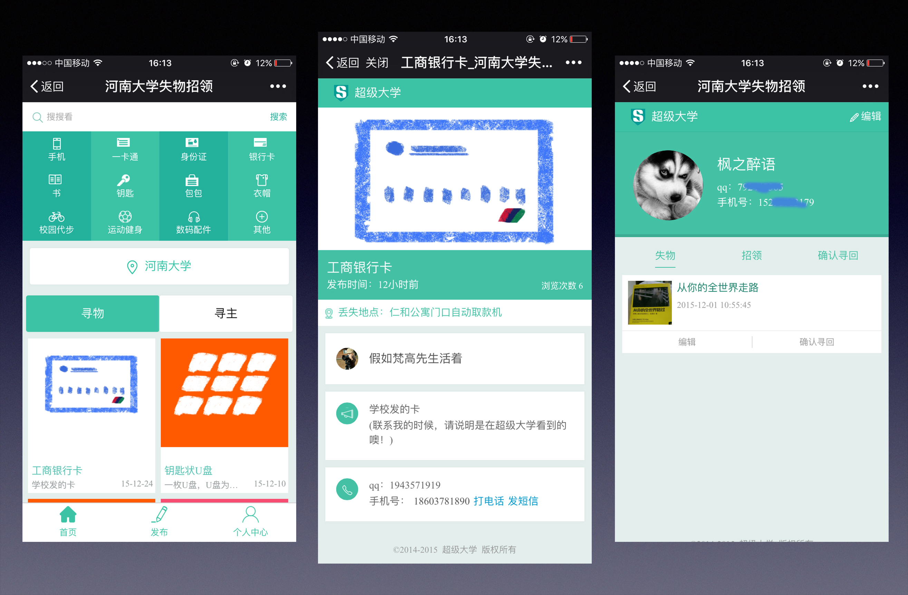
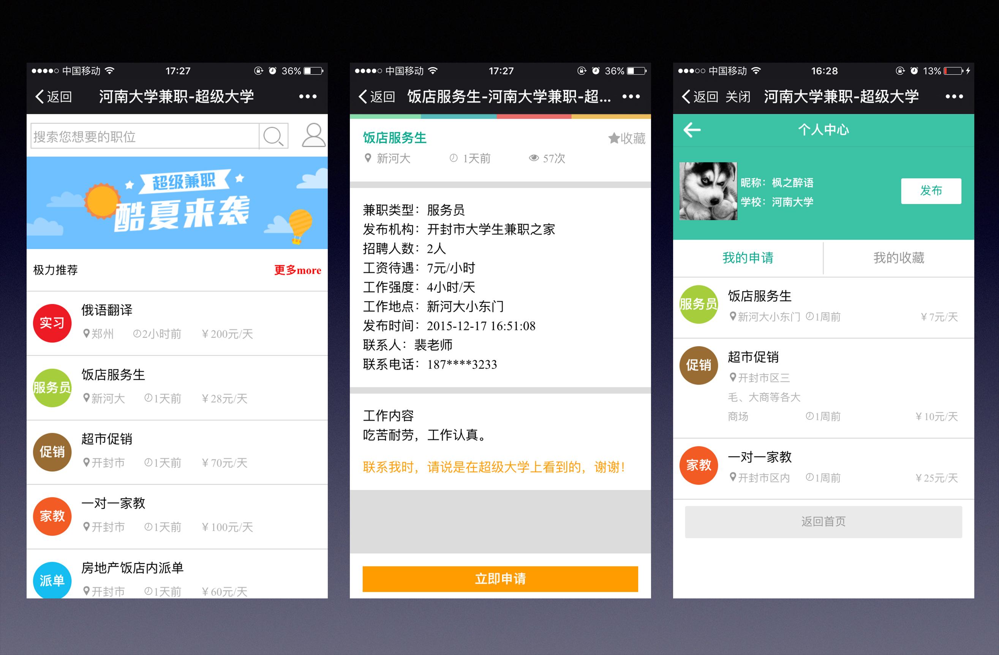
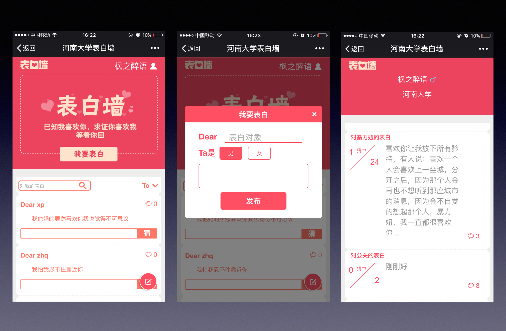
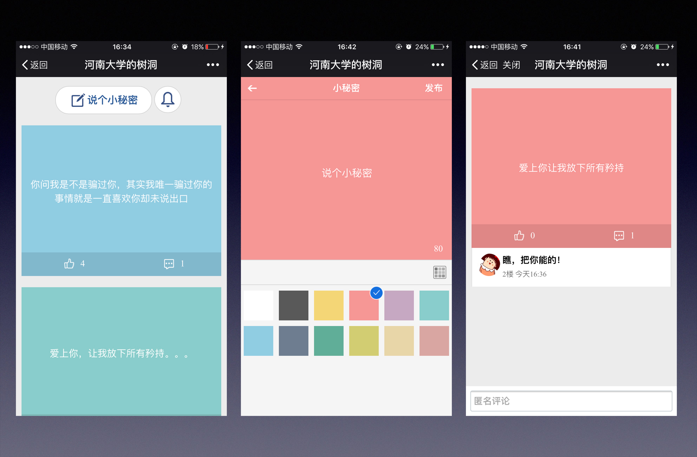

## 超级大学查成绩查课表系统 ##

**超级大学** 是一款为高校公众号运营提供教务、社交等功能与便携的校园服务，给大学生们提供最快捷获取校园新闻，社团活动，校园招聘信息，让大学不再是一片信息孤岛，你的大学，一个就够了。

**界面预览：**

----------

----------
## 主要功能：##
1. 查成绩
2. 查课表

## 快速开始：##
	- 选择云主机或是本地服务器
	- 安装环境（jdk1.7，tomcat7.0，mysql5.6）
	- 为了更方便的查看代码您可以安装java的开发工具，我这里用的是myEclipse，执行sql脚本生成数据库表
	- 部署项目到服务器
	- 启动tomcat

### 补充说明：###
	1. 请尽量不要用war包的形式部署项目（可能有些文件会找不到路径）
	2. 青果教务系统不能在阿里云上正常工作
	3. 数据库字符集：utf8 -- UTF-8 Unicode，排序规则：utf8_general_ci
## 	其他更多功能：##

**二手交易**

----------
匿名评教
----------

----------

失物招领
----------

----------

招聘平台
----------

----------

约电影、表白墙
----------

----------

树洞
----------

----------
